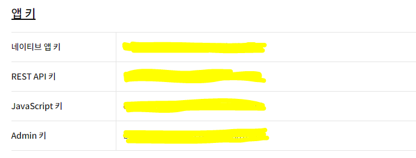
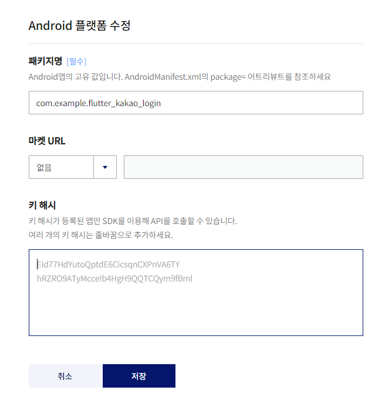
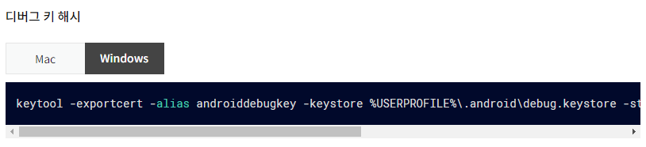
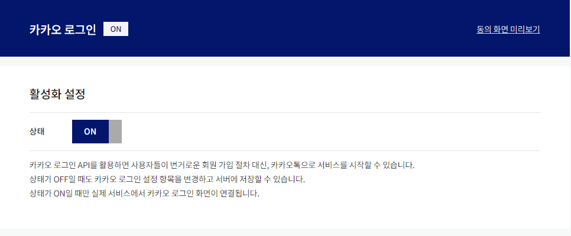
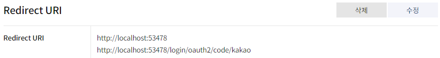
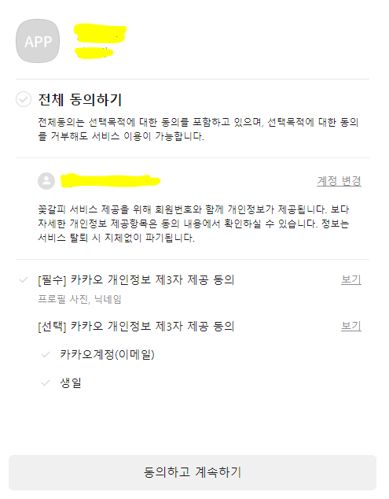

:calendar: 2023. 01. 25. Wed.

# :memo:  1. 플러터 카카오 로그인 (kakao_flutter_sdk)


## 1. pubspec.yaml에 kakao_flutter_sdk 추가

```yaml
dependencies:
  kakao_flutter_sdk: ^1.3.1 # 전체 추가
  kakao_flutter_sdk_user: ^1.3.1 # 카카오 로그인
  kakao_flutter_sdk_talk: ^1.3.1 # 카카오톡(소셜, 메시지)
  kakao_flutter_sdk_story: ^1.3.1 # 카카오스토리
  kakao_flutter_sdk_share: ^1.3.1 # 카카오톡 공유
  kakao_flutter_sdk_navi: ^1.3.1 # 카카오내비
```

sdk는 전부 다 추가할 필요 없다. 로그인만 사용할 거라면 `kakao_flutter_sdk_user` 만 추가하면 된다.

<br>

## 2. Kakao Developers에 애플리케이션 등록 및 설정

### 2-1. 네이티브 키

[Kakao Developer](https://developers.kakao.com/console/app)
에서 애플리케이션을 추가하고 부여된 앱키 확인 (환경변수로 설정)

<br>



### 2-2. 카카오 로그인 플랫폼 설정



여기서 패키지명은, `AndroidManifest.xml`에서 확인할 수 있다.

### 2-3. 키 해시 발급받기

[Kakao KeyHash](https://developers.kakao.com/docs/latest/ko/getting-started/sdk-android) 의 가이드 대로 키 해시를 발급받을 수 있다. <br>



윈도우면 Window, Mac이면 Mac의 터미널에서 해당 명령어를 입력하면 KeyHash를 발급받을 수 있는데, 이때 발급받은 Hash를 플랫폼의 키 해시에 붙여 넣는다


### 2-4. 카카오 로그인 활성화 / Redirect URI 설정





`Redirect Uri`는 카카오 로그인 수행 이후 리다이렉트 될 uri를 등록하면 된다. 로컬이 아니라 서버를 이용할 시, 추가로 등록해야 할 uri가 있기 때문에 공식 문서를 확인해야 한다.

<br> 

## 3. (안드로이드 기준) 안드로이드 설정

### 3-1. build.gradle에서 minSdkVersion 설정

안드로이드 기준이라면, 해당 SDK가 정상적으로 작동할 수 있도록 minSDK 기준을 변경해주어야 한다.

`app` 수준의 `build.gradle` 에서 `minSdkVersion`을 다음과 같이 수정해준다. (버전에 따라 19일 수도 있음)

```kotlin
defaultConfig {
  applicationId "com.example.flutter_kakao_login"
  minSdkVersion 21 // 버전 변경
  targetSdkVersion flutter.targetSdkVersion
  versionCode flutterVersionCode.toInteger()
  versionName flutterVersionName
}
```

### 3-2. AndroidManifest에 Activity 추가
```xml
 <activity 
    android:name="com.kakao.sdk.flutter.AuthCodeCustomTabsActivity"
    android:exported="true">
    <intent-filter android:label="flutter_web_auth">
        <action android:name="android.intent.action.VIEW" />
        <category android:name="android.intent.category.DEFAULT" />
        <category android:name="android.intent.category.BROWSABLE" />
        <data android:scheme="kakao${Native Key}" android:host="oauth"/>
        <!-- Application에서 받은 Key 번호 ex) kakao812341efe4dfg3efa354 -->
    </intent-filter>
</activity>
```

<br>

## 4. Kakao Init

[Kakao Developers 문서 참고](https://developers.kakao.com/docs/latest/ko/getting-started/sdk-flutter)

`main.dart` 에서 `runApp()` 을 실행하기 전에 Kakao SDK를 init 해준다. 

```dart
void main() async {
   // initialize 되는 부분들에 대해 보증
  WidgetsFlutterBinding.ensureInitialized();

  // dotenv 환경변수 사용 (선택)
  await dotenv.load(fileName: 'config/.env');

  // KakaoSdk를 initialize
  KakaoSdk.init(
    nativeAppKey: dotenv.get(
      'KAKAO_NATIVE_APP_KEY',
      fallback: 'sane-default',
    ),
    // 선택
    javaScriptAppKey: dotenv.get(
      'KAKAO_REST_API_KEY',
      fallback: 'sane-default',
    ),
  );

  // 이후에 runApp() 수행
  runApp(
    const MyApp(),
  );
}
```

<br>

## 5. Login / Logout 로직 작성 (with viewModel)

### 5-1) Abstract class로 로그인 / 로그아웃 기능 정형화 (선택)

```dart
// 이후에 카카오 외에 네이버나 페이스북 로그인 등에 동일한 기능을 오버라이드 하기 위해
abstract class ILogin {
  Future<bool> login();
  Future<bool> logout();
}
```

`abstract class` 를 이용하는 이유는, 동일한 기능을 정형화해놓고, 이후에 다른 소셜 로그인을 사용할 경우에 오버라이드만 해서 재가공하기 위함이다.

### 5-2) Kakao Login / Logout 로직 작성

[Kakao Developers 문서 참고](https://developers.kakao.com/docs/latest/ko/kakaologin/flutter)
[오준석 생활코딩 Youtube 참고]

```dart
import 'package:flutter_kakao_login/kakao/providers/login_interface.dart';
import 'package:kakao_flutter_sdk_user/kakao_flutter_sdk_user.dart';

class KakaoLogin implements ILogin {
  @override
  Future<bool> login() async {
    try {
      // 1. 카카오톡 installed 여부 확인
      bool isInstalled = await isKakaoTalkInstalled();
      // 1-1) 인스톨이 되어 있다면, 카카오톡으로 로그인 유도;
      if (isInstalled) {
        try {
          await UserApi.instance.loginWithKakaoTalk();
          print('kakaotalk 카카오톡 로그인 성공, ${isInstalled}');
          return true;
        } catch (e) {
          return false;
        }
      } else {
        // 1-2) 인스톨이 되어있지 않다면, 카카오 계정으로 로그인 유도
        try {
          await UserApi.instance.loginWithKakaoAccount();
          print('kakaoAccount 카카오톡 로그인 성공, ${isInstalled}');
          return true;
        } catch (e) {
          return false;
        }
      }
    } catch (e) {
      return false;
    }
  }

  @override
  Future<bool> logout() async {
    try {
      await UserApi.instance.unlink();
      print('카카오톡 로그아웃 성공');
      return true;
    } catch (e) {
      return false;
    }
  }
}
```

미리 작성해둔 `abstract class`를 implements 받아서 login과 logout 기능을 오버라이딩 했다.


### 5-3) ViewModel에서 로그인 상태 체크

```dart
import 'package:flutter_kakao_login/kakao/providers/login_interface.dart';
import 'package:kakao_flutter_sdk_user/kakao_flutter_sdk_user.dart';

class ViewModel {
  final ILogin _iLogin;
  ViewModel(this._iLogin);

  // 1. 로그인 상태 체크
  bool isLogined = false;

  // 2. 카카오톡의 User 정보 가져오기
  User? user;
  // 3. 로그인 기능
  login() async {
    print('로그인 성공');
    isLogined = await _iLogin.login();
    // 3-1) 로그인이 성공했다면
    if (isLogined) {
      user = await UserApi.instance.me();
      print(user?.kakaoAccount?.profile?.profileImageUrl);
    }
  }

  Future logout() async {
    await _iLogin.logout();
    isLogined = false;
    user = null;
  }
}
```

<br>

## 6. 로그인 페이지에 반영

작성한 로직들을 화면에 반영한다. 카카오 규격 버튼을 사용해야 하나, 여기서는 기본 `Elevated Button`을 이용해서 기능만 테스트 해보았다.

```dart

import 'package:flutter/material.dart';
import 'package:flutter_kakao_login/common/layout/main_layout.dart';
import 'package:flutter_kakao_login/kakao/models/view_model.dart';
import 'package:flutter_kakao_login/kakao/providers/kakao_login.dart';
import 'package:kakao_flutter_sdk/kakao_flutter_sdk.dart';

class HomeScreen extends StatefulWidget {
  const HomeScreen({super.key});

  @override
  State<HomeScreen> createState() => _HomeScreenState();
}

class _HomeScreenState extends State<HomeScreen> {
  // _iLogin을 상속받은 KakaoLogin()
  final viewModel = ViewModel(KakaoLogin());
  @override
  Widget build(BuildContext context) {
    return MainLayout(
      title: '카카오 로그인',
      body: Center(
        child: Column(
          children: [
            if (viewModel.user?.kakaoAccount?.profile?.profileImageUrl != null)
              Image.network(
                  viewModel.user?.kakaoAccount?.profile?.profileImageUrl ?? ''),
            Text('${viewModel.isLogined}'),
            ElevatedButton(
              onPressed: () async {
                await viewModel.login();
                setState(() {
                  // 로그인 후에 화면 갱신
                });
              },
              child: const Text(
                '카카오 로그인',
              ),
            ),
            ElevatedButton(
              onPressed: () async {
                await viewModel.logout();
                setState(() {
                  // 로그아웃 후에 화면 갱신
                });
              },
              child: const Text(
                '카카오 로그아웃',
              ),
            ),
          ],
        ),
      ),
    );
  }
}
```

화면에 로직을 반영하면 다음과 같이 로그인 , 로그아웃 버튼을 누를 시 기능이 작동한다




<br>

기본 기능만 반영해 보았다. 이 로그인 기능을 `Provider`나 `river_pod` 과 같은 상태관리 툴을 이용해서 작성해 놓으면 이후에 여러 서비스들에서 동일하게 작동시킬 수 있게 된다.